<div align="center">

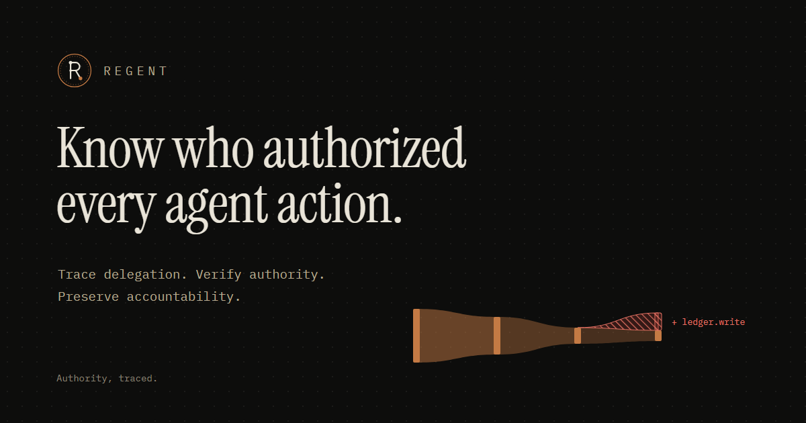

# REGENT

**Authority, traced.**

REGENT reconstructs the authority chain behind AI-agent actions<br/>and verifies that delegated authority never silently expands.

[Quick start](#quick-start) · [How it works](#how-it-works) · [Screenshots](#a-tour) · [Security](#security) · [Documentation](#documentation)


[](https://github.com/het-P301204/regent/actions/workflows/ci.yml)


</div>

---

An AI agent reads a customer record, posts a journal entry, approves an invoice. The log says *what* ran. It almost never says **who authorized it, through which agents, under what limits — and whether the action stayed inside them.**

REGENT answers that question from the records your agent platform already emits:

> **Who authorized this action, through what delegation chain, under what effective authority, and did the action remain within that authority?**

It rebuilds every action's delegation chain — human principal → agent → sub-agents → tool → execution identity → resource — checks it against seven invariants with a **deterministic** engine, and shows you the exact edge where authority broke.

<div align="center">
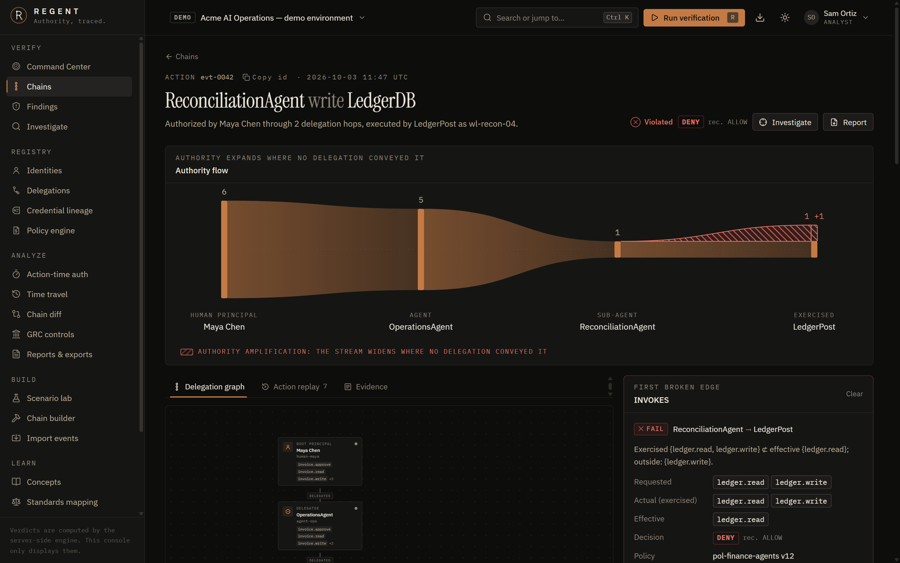
<sub><b>One action, fully reconstructed.</b> The authority flow narrows at every hop — until <code>ledger.write</code> appears at the tool, conveyed by no delegation. REGENT names the broken edge and the confused deputy behind it.</sub>
</div>

---

## Why this exists

Agents increasingly act **under someone else's authority** — and hand that authority on to sub-agents and tools. Three things go wrong, quietly:

| | What happens | Why logging alone does not catch it |
|---|---|---|
| **Attribution breaks** | A sub-agent is spawned without a recorded delegation. Its actions trace back to nobody. | The action is logged. Who authorized it is not. |
| **Authority amplifies** | Every delegation is read-only, but the tool runs as a workload identity with standing write access. The write succeeds. | No single component authorized it. It is a *confused deputy spread across a chain*. |
| **Authorization goes stale** | A delegation is revoked at 14:00. A decision cached at 13:30 lets the agent act at 14:40. | Provision-time said *allowed*; action-time should have said *denied*. |

Prevention tooling (gateways, policy engines) is crowded — and it presupposes the system already knows who authorized an action through which chain. Often it does not. REGENT is the **verification and accountability** half: it does not enforce, it **proves or disproves** from evidence.

This framing tracks recent guidance: the NIST NCCoE concept paper on software and AI agent identity and authorization (Feb 2026) calls for authorization evaluated *at action time* and audit trails that attribute actions to specific agents under specific delegations; Singapore IMDA's Model AI Governance Framework for Agentic AI (Jan 2026) asks for an audit trail of which agent acted under whose authorization. REGENT maps to the standards NIST names (OAuth 2.x, OpenID Connect, SPIFFE/SPIRE, SCIM, NGAC, MCP) conceptually — it claims no compliance with any of them.

## Quick start

Requires **Node 24** (it runs TypeScript directly — no build step for the server or CLI). No Docker or database install needed: development uses [PGlite](https://pglite.dev), real PostgreSQL compiled to WASM, in-process.

```bash
git clone https://github.com/Het-P301204/regent.git
cd regent
npm install
npm run dev
```

Open **http://localhost:5173** and sign in as one of the demo personas (admin, analyst, auditor, viewer) of the fictional *Acme AI Operations*. The demo environment loads on first start: 37 synthetic agent actions across four human principals, with healthy chains and eight different kinds of failure.

Or verify a chain from the terminal — same engine, no server:

```bash
npm run regent -- verify examples/chain.json
```

```text
REGENT  Authority, traced.

Delegation Chain Verification
─────────────────────────────

evt-builder-01  2026-10-03T09:30:00.000Z
Human       Alice
Agent       ResearchAgent  {customer.read}
Sub-Agent   CustomerAgent  {customer.read}
Tool        CustomerSearch
Execution   workload-042
Credential  cred-workload-042

ATTRIBUTION             PASS
CHAIN COMPLETENESS      PASS
AUTHORITY INTEGRITY     FAIL
SCOPE CONTAINMENT       FAIL
IDENTITY BINDING        PASS
CREDENTIAL BINDING      PASS
ACTION-TIME VALIDITY    PASS
POLICY TRACEABILITY     PASS
APPROVAL                PASS
RECORD COMPLETENESS     WARN
DECISION                DENY  (recorded ALLOW)

Authority amplification detected

Delegated (effective):
  customer.read
Exercised:
  customer.read, customer.write
Unauthorized expansion:
  customer.write

Findings (1)
CRITICAL Authority amplification  REG-AMP-32553331da
         CustomerAgent exercised customer.write, which no delegation in its chain legitimately conveyed.
```

Gate CI on it: `regent analyze events.jsonl --fail-on high` exits `1` when a finding at or above that severity exists.

## How it works

### Three structures, kept apart

The single most important modelling decision. Collapsing these is how authority gets lost.

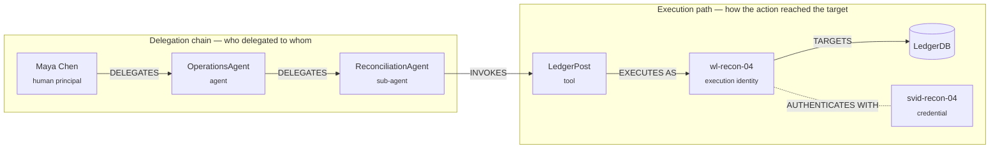

Only **principals** hold and pass on authority. Tools, execution identities, credentials and resources take part in an action but are never delegation hops. The third structure — the **evidence chain** (action event → delegation events → identities → policy version → credential binding) — is what every finding links back to.

### The pipeline

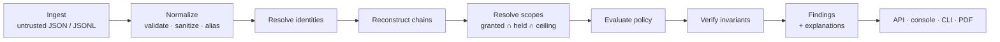

`@regent/core` is a pure TypeScript engine — no I/O, no clock, no randomness. **Same input, byte-identical output**, enforced by tests that shuffle the input records and compare runs. The API stores evidence relationally, re-loads it and re-verifies, and its input digest for a file equals the CLI's for the same file.

### The invariants

```
Exercised ⊆ Effective ⊆ Granted ⊆ Effective(delegator)
```

| # | Invariant | Fails when |
|---|---|---|
| 1 | **Attribution** | the action cannot be traced to a root principal |
| 2 | **Parentage** | a delegated principal has no valid delegator |
| 3 | **Scope contraction** | a delegation grants more than its delegator held |
| 4 | **Action containment** | an action exercises more than its effective scope |
| 5 | **Identity binding** | the execution identity or credential belongs to someone else |
| 6 | **Policy traceability** | the decision does not record the exact policy version |
| 7 | **Temporal validity** | a delegation, identity or credential was not valid *at action time* |

Ten configurable rules (`AUTH-001` … `AUTH-010`) enforce them. A disabled rule reports **SKIPPED**, never PASS.

### Principles the engine holds to

- **Unknown is never safe.** Missing evidence yields `UNKNOWN` or *incomplete* — never `PASS`, and never a violation either. An unattributable action is reported as unattributable, not as unauthorized.
- **Nothing is assumed.** A hop with no recorded parent breaks the chain. When a record omits its parent delegation, REGENT links by registry lookup *only* if exactly one candidate exists — and says so.
- **Amplification is reported once, where it entered.** If hop 2 grants authority its delegator never held, hop 2 is the finding — not every hop downstream that re-grants it.
- **Explanations are generated, not guessed.** The "Why did this happen?" panel is deterministic prose built from the verification result. No language model decides or explains anything.
- **Imported data is untrusted evidence.** Schema-validated, size-limited, stripped of control and bidi characters, never executed. Declared root and parent claims are *checked* against the delegation records, never trusted.

## A tour

<table>
<tr>
<td width="50%">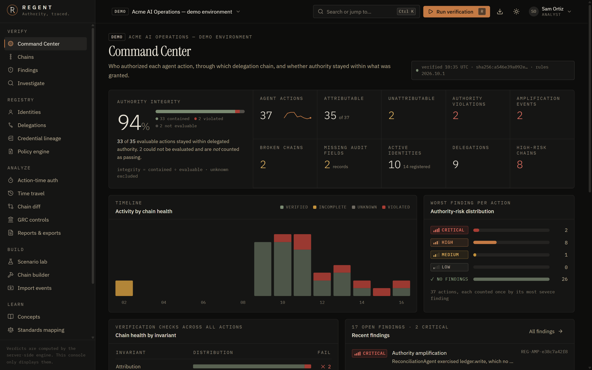<br/><b>Command Center.</b> Authority integrity with its formula shown — <i>unknown is excluded, never counted as passing</i> — activity by chain health, risk distribution and per-invariant results.</td>
<td width="50%">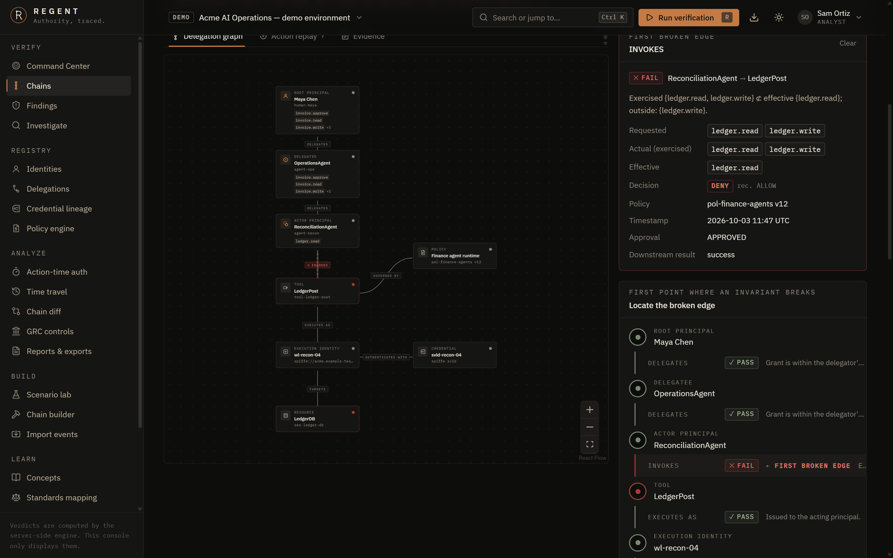<br/><b>Delegation graph.</b> Principals down the spine, the execution path below, every edge labelled by relationship and coloured by the engine's result. The first broken edge is animated.</td>
</tr>
<tr>
<td>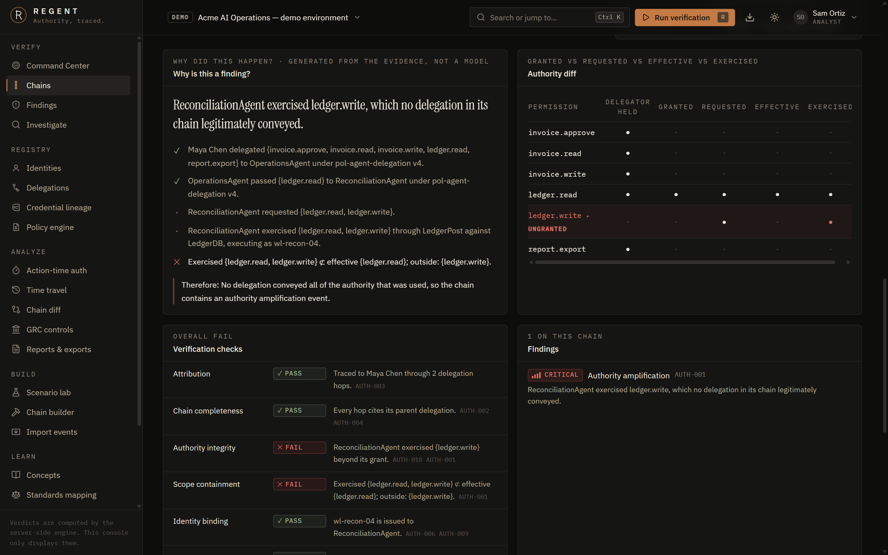<br/><b>Why did this happen? + Authority diff.</b> Granted vs requested vs effective vs exercised, aligned by permission — the ungranted one stands alone on its own row.</td>
<td>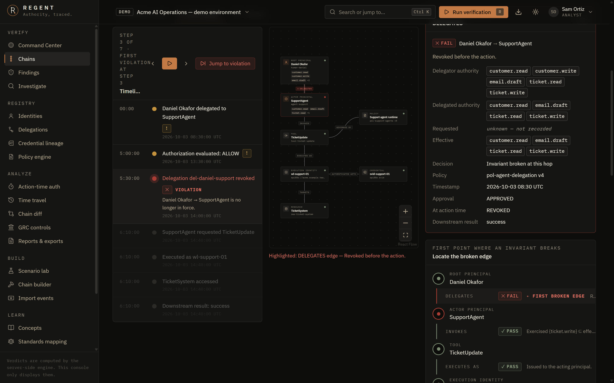<br/><b>Action replay.</b> Step through recorded timestamps only — nothing is invented. Jump to the violation and the exact edge lights up: here, a decision cached before a revocation.</td>
</tr>
<tr>
<td>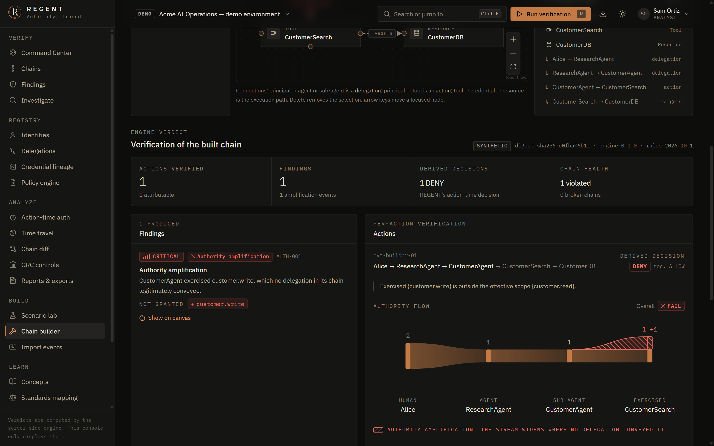<br/><b>Chain builder.</b> Drag principals, tools and credentials onto a canvas (or use the keyboard), press <b>Verify chain</b>, and the engine marks the edge it flagged.</td>
<td>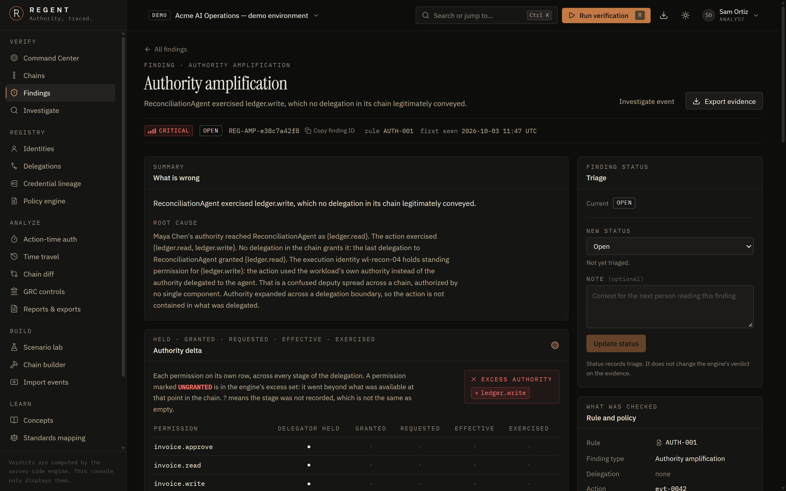<br/><b>Findings with an evidence locker.</b> Root cause, authority delta, broken edge, remediation, and every claim linked to a SHA-256-digested evidence record.</td>
</tr>
<tr>
<td>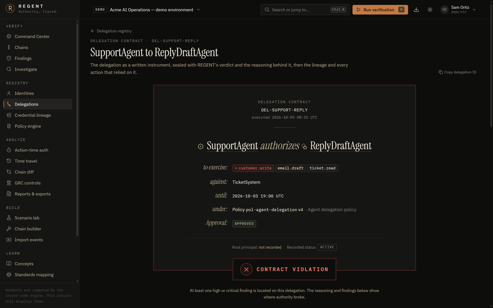<br/><b>Delegations as contracts.</b> Each delegation rendered as a human-readable instrument with a contract-integrity seal.</td>
<td>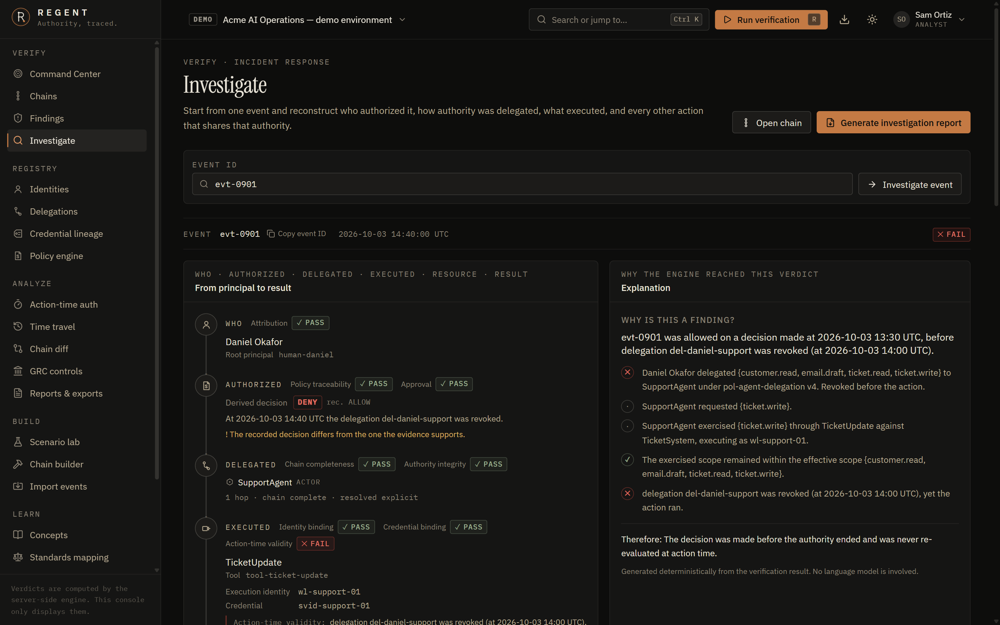<br/><b>Incident investigation.</b> From one event id: who, authorized, delegated, executed, resource, result — plus related actions, timeline and a one-click PDF report.</td>
</tr>
<tr>
<td>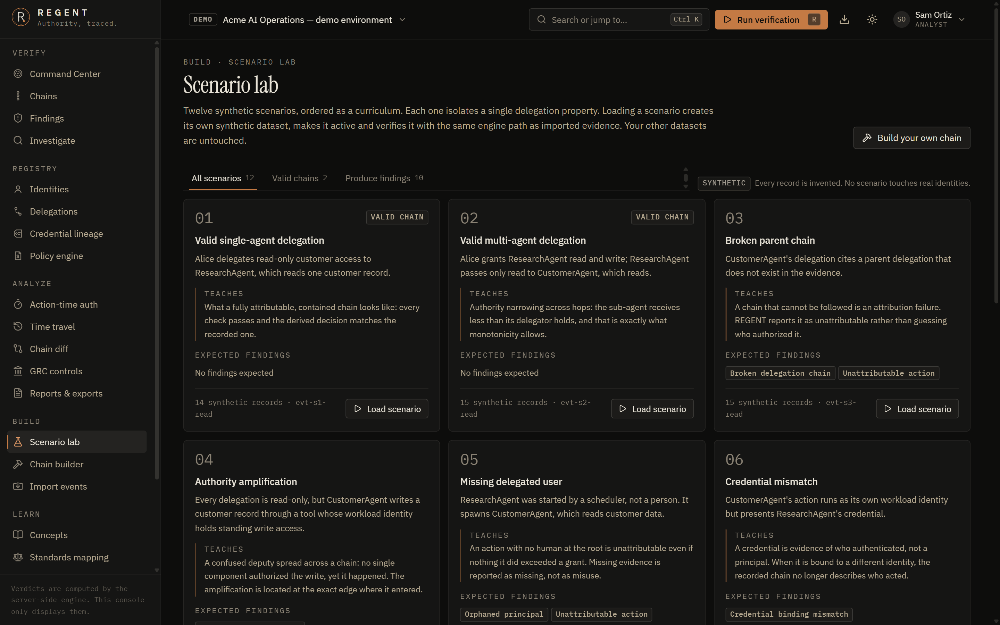<br/><b>Scenario lab.</b> Twelve synthetic scenarios, one property each. Tests enforce that each produces exactly the findings it teaches.</td>
<td>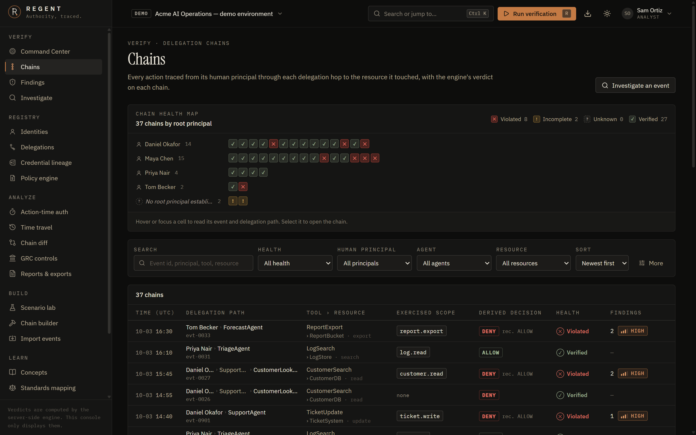<br/><b>Chain health map.</b> Every chain at a glance, grouped by root principal; filters for principal, agent, resource, policy, severity, attribution and authority status.</td>
</tr>
<tr>
<td>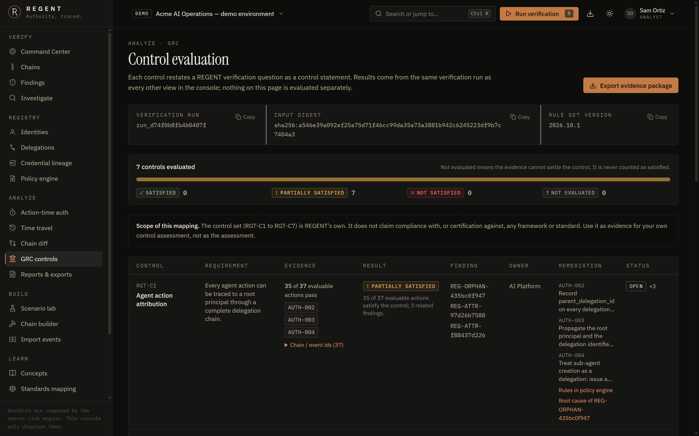<br/><b>GRC mode.</b> Control, requirement, evidence, result, finding, owner — derived from the same run, exportable as an evidence package.</td>
<td>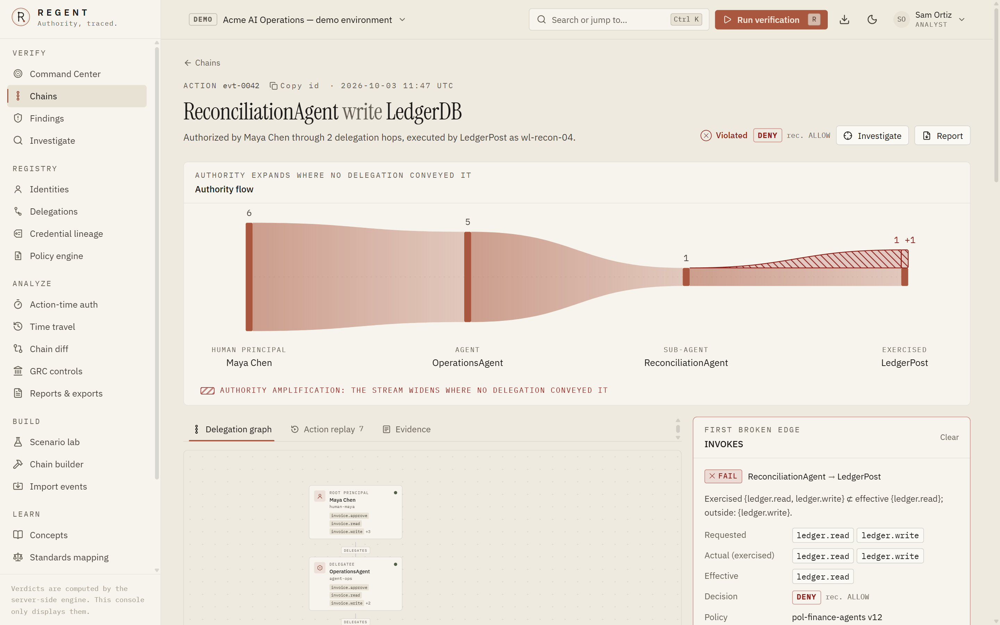<br/><b>Warm-paper light theme.</b> Designed, not inverted. Colour only ever carries state, and every state also has a glyph and a word.</td>
</tr>
</table>

<div align="center">
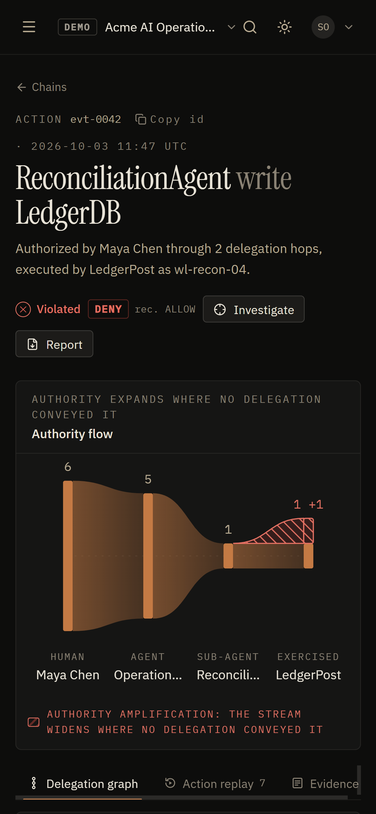<br/>
<sub>Down to 375 px: findings, chain summary, verification and the authority flow stay usable; the graph becomes an accessible ordered list.</sub>
</div>

## What's inside

**Verify** — deterministic engine · 16 finding types with stable ids · record-completeness analyzer with a configurable schema · authority integrity with its formula shown · re-run verification from the console (`R`) or API

**Investigate** — delegation graph with node/edge inspector · *Locate the broken edge* · authority flow · authority diff · action replay · evidence locker · incident investigation · time travel (authority at any instant) · chain diff · fuzzy search and a `Ctrl/⌘ K` command palette

**Build** — 12-scenario lab · drag-and-drop chain builder · JSON / JSONL / paste / synthetic import with a validation report · provision-time vs action-time simulation

**Audit** — GRC controls and an evidence package · PDF security and investigation reports · JSON and CSV exports (formula-injection safe) · the stable `regent.finding/v1` format · REGENT's own audit log · learning mode for 11 concepts · standards mapping

**Operate** — REST API with an [OpenAPI document](docs/api.md) · session auth + CSRF + four roles + revocable, expiring API tokens · organization-scoped data · CLI with CI exit codes · Docker, Compose and CI configuration

### The finding types

| Authority | Attribution | Identity & time | Evidence |
|---|---|---|---|
| `AUTHORITY_AMPLIFICATION` | `UNATTRIBUTABLE_ACTION` | `EXECUTION_IDENTITY_MISMATCH` | `MISSING_POLICY_VERSION` |
| `SCOPE_VIOLATION` | `BROKEN_DELEGATION_CHAIN` | `CREDENTIAL_BINDING_MISMATCH` | `MISSING_REQUESTED_SCOPE` |
| `MISSING_APPROVAL` | `ORPHANED_PRINCIPAL` | `ACTION_TIME_AUTHORIZATION_FAILURE` | `MISSING_DELEGATED_SCOPE` |
| | `UNKNOWN_REFERENCE` | `STALE_DELEGATION` · `REVOKED_IDENTITY` · `REVOKED_CREDENTIAL` | |

## Architecture

```
regent/
├── packages/core/        the engine: normalize · reconstruct · verify · explain · replay · diff · GRC
├── apps/api/             Hono REST API · PostgreSQL / PGlite · auth · reports · OpenAPI
├── apps/web/             React console — visualization only (ESLint forbids importing engine logic)
├── apps/cli/             regent CLI — same engine, offline, CI exit codes
├── database/migrations/  plain, parameterized SQL; checksummed on apply
├── scenarios/            the 12 lab scenarios + the Acme demo dataset, as JSON
├── tests/adversarial/    15 hostile datasets the engine must classify correctly
├── tests/e2e/            Playwright journeys against the production build
└── docs/                 architecture, models, engine, API, CLI, threat model, deployment
```

- **The engine decides; everything else displays.** The web console imports engine *types* only — a lint rule fails the build if it imports a function. Every verdict on screen came from the API.
- **One SQL dialect, two engines.** PGlite in development and tests; `node-postgres` against a real server in production, tested over the PostgreSQL wire protocol.
- **Why not Next.js?** The console is an authenticated single-page app behind a separate API, and the security engine must not live in UI code. Vite + Hono keeps that boundary physical. See [architecture.md](docs/architecture.md).

## Security

REGENT is an **accountability and verification** tool. It does not enforce authorization, call real tools, test external targets or hold real credentials — it verifies records. All demo and scenario data is synthetic.

What is implemented, not aspirational:

- scrypt password hashing; session and API tokens stored only as SHA-256 hashes
- `HttpOnly`, `SameSite=Strict` cookies (`Secure` in production); synchronizer CSRF token, Origin check, and JSON-only mutations so no cross-site simple request reaches a mutating route
- four roles (viewer · auditor · analyst · admin); every query scoped to an organization; API tokens expire and can be listed and revoked
- strict CORS allowlist, CSP and security headers, streaming body limits, rate limits keyed on the real client (trusted-proxy hops, IPv6 /64) and per account
- untrusted-input handling: zod validation, prototype-pollution-safe parsing, control/bidi stripping (no terminal-escape or bidi injection into CLI, PDF, CSV or browser), CSV formula neutralization
- no stack traces to clients; structured logs without secrets; REGENT's own audit log

The codebase went through an adversarial internal review. It found a quadratic-work denial of service, demo credentials surviving demo-mode-off, non-revocable tokens, a forgeable `X-Forwarded-For` key and terminal-escape injection into the CLI, among others. All are fixed with regression tests. The findings, fixes and residual risks are written up in [security-model.md](docs/security-model.md#security-review), and the [threat model](docs/threat-model.md) is honest about what REGENT *cannot* detect (a record that was never emitted, for one).

Evidence digests are SHA-256 over canonical JSON: they detect change; **they are not signatures** and do not provide non-repudiation.

## Testing

```bash
npm run verify        # lint · typecheck · unit + integration tests · production build
npm run test:e2e      # Playwright against the production build (run npm run build first)
node scripts/bench.ts # engine timings on hostile-but-valid input sizes
```

| Suite | What it proves |
|---|---|
| **154 unit + integration tests** | scope algebra; chain reconstruction (lookup, ambiguity, cycles, depth); every scenario produces *exactly* its expected findings; the 15 adversarial datasets; determinism under record shuffling; the API (auth, CSRF, roles, tenant isolation, triage surviving re-runs, exports, PDFs); the production `pg` driver over the wire protocol; large-dataset response times; the CLI |
| **18 end-to-end tests** | the definition-of-done journey in a real browser: sign in, trace to the human principal, locate the broken edge, replay, findings and evidence, scenario lab, builder, import, command palette, exports, role gating, theme, phone layout |

Measured on a laptop (`node scripts/bench.ts`): 15,000 actions sharing the same findings verify in **~0.9 s**; ~50,000 records in **~4 s**; 8,000 actions on a 31-hop chain with 256-entry wildcard scopes in **~4.7 s**.

**Status.** Every push runs the full pipeline in [GitHub Actions](https://github.com/het-P301204/regent/actions/workflows/ci.yml): lint, typecheck, tests, build, Playwright end-to-end, migrations and API smoke checks against a real PostgreSQL 17 server, the container image build with a health check, SBOM and Trivy scan, dependency audit, gitleaks over the full history, and CodeQL — all passing. The Compose stack as a whole and the release workflow have not been run, and no hosted deployment is claimed. See [deployment.md](docs/deployment.md#status).

## Documentation

| | |
|---|---|
| [Getting started](docs/getting-started.md) | install, personas and roles, a guided walkthrough |
| [Concepts](docs/concepts.md) | the canonical terminology |
| [Architecture](docs/architecture.md) | pipeline, boundaries, determinism |
| [Delegation model](docs/delegation-model.md) | records, input formats, ChainSpec, reconstruction rules |
| [Authority model](docs/authority-model.md) | scope algebra, effective scope, the invariants, decisions |
| [Verification engine](docs/verification-engine.md) | checks, completeness, chain health, finding types |
| [Policy engine](docs/policy-engine.md) | AUTH-001 … AUTH-010 and configuration |
| [API](docs/api.md) | endpoints, auth, errors, `regent.finding/v1` |
| [CLI](docs/cli.md) | commands, flags, exit codes, CI gating |
| [Scenarios](docs/scenarios.md) | the lab and the adversarial datasets |
| [Security model](docs/security-model.md) · [Threat model](docs/threat-model.md) | controls, review, residual risk |
| [Testing](docs/testing.md) · [Deployment](docs/deployment.md) · [Roadmap](docs/roadmap.md) | |

[Contributing](CONTRIBUTING.md) · [Security policy](SECURITY.md) · [Changelog](CHANGELOG.md)

## License

[Apache-2.0](LICENSE). Every person, organization, identity and credential in the demo and scenarios is fictional.
